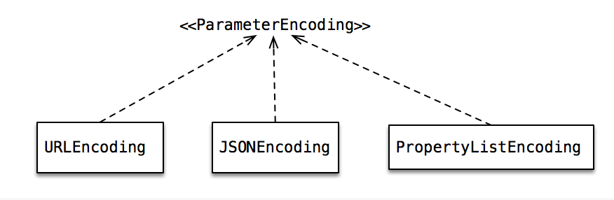

#读源码学编程Swift之Alamofire 0

##AFError

#### AFError简介

   错误返回类型处理，其中封装以下了不同的错误
<pre>
   /// - invalidURL:                  Returned when a `URLConvertible` type fails to create a valid `URL`.
   
/// - parameterEncodingFailed:     Returned when a parameter encoding object throws an error during the encoding process.

/// - multipartEncodingFailed:     Returned when some step in the multipart encoding process fails.

/// - responseValidationFailed:    Returned when a `validate()` call fails.

/// - responseSerializationFailed: Returned when a response serializer encounters an error in the serialization process. 

</pre>

#### AFError架构

错误类型 采用 ***枚举enum***的形式对网络错误进行罗列， ***内嵌enum***做出了细的错误分类，职责明确；另外运用 ***扩展extension*** 方式对枚举添加方法获取错误详情。

##ParameterEncoding

#### ParameterEncoding简介

实现了网络解码定义

#### ParameterEncoding 结构

##Swift代码学习

1.swift3.0 开始，定义枚举值，统一小写

2.指定枚举类型的原始数据类型,后面必须要指定类型。

***枚举类型***

可以是int string基本类型，对象不可以，必须是实现RawRepresentable协议类型才可以

<pre>
public enum HTTPMethod: String {
    case options = "OPTIONS"
    case get     = "GET"
    case head    = "HEAD"
    case post    = "POST"
    case put     = "PUT"
    case patch   = "PATCH"
    case delete  = "DELETE"
    case trace   = "TRACE"
    case connect = "CONNECT"
}
</pre>

2.1 提供值创建枚举

比如：

<pre>
public enum ParameterEncodingFailureReason {
        case missingURL
        case jsonEncodingFailed(error: Error)
        case propertyListEncodingFailed(error: Error)
    }

</pre>

这种方式创建枚举不能使用 == 来做判断处理，我们应该使用模式匹配的方式 处理，这种方式强调的事值传递：
<pre>

extension AFError.ParameterEncodingFailureReason {
    var underlyingError: Error? {
        switch self {
        case .jsonEncodingFailed(let error), .propertyListEncodingFailed(let error):
            return error
        default:
            return nil
        }
    }
}

</pre>

3.typealias 是用来为已经存在的类型重新定义名字的，通过命名，可以使代码变得更加清晰

<pre>
public typealias Parameters = [String: Any]
</pre>

4.??操作符，先对可选值进行拆包，如果不为 nil 返回操作符前面的值，如果为空返回后者。
<pre>
a ?? b 等价于 a != nil ? a! : b
</pre>

5.Swift3.0访问权限则依次为：open，public，internal，fileprivate，private。
具体详情：<http://www.jianshu.com/p/604305a61e57>

6.CFGetTypeID
<pre>
extension NSNumber {
    fileprivate var isBool: Bool { return CFBooleanGetTypeID() == CFGetTypeID(self) }
}
</pre>
CFGetTypeID:返回不透明类型的唯一标示符
<https://developer.apple.com/reference/corefoundation/1521218-cfgettypeid>

在Object-C中 可以这么玩：
<http://stackoverflow.com/questions/8168012/check-id-iskindoftype-cftype>
<pre>
    NSObject *objc = [NSDictionary dictionary];
    
    CFTypeID Id  = CFGetTypeID((__bridge CFTypeRef)objc);
    
    if (Id == CFDictionaryGetTypeID() ) {
        
        NSLog(@"我是字典");
        
    }

</pre>
